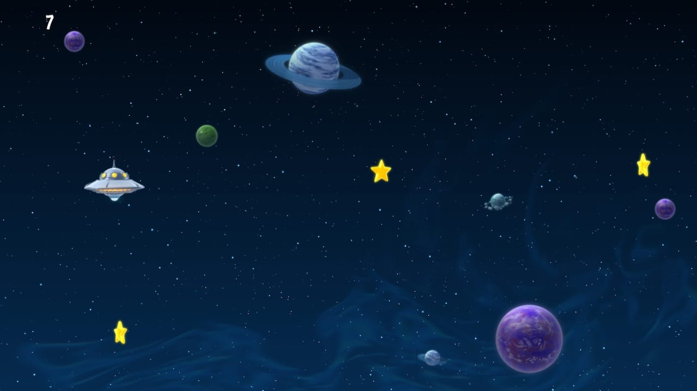
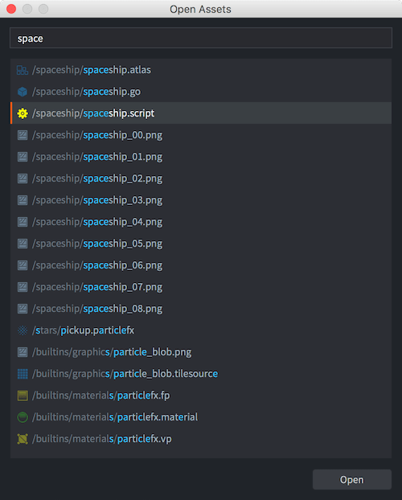
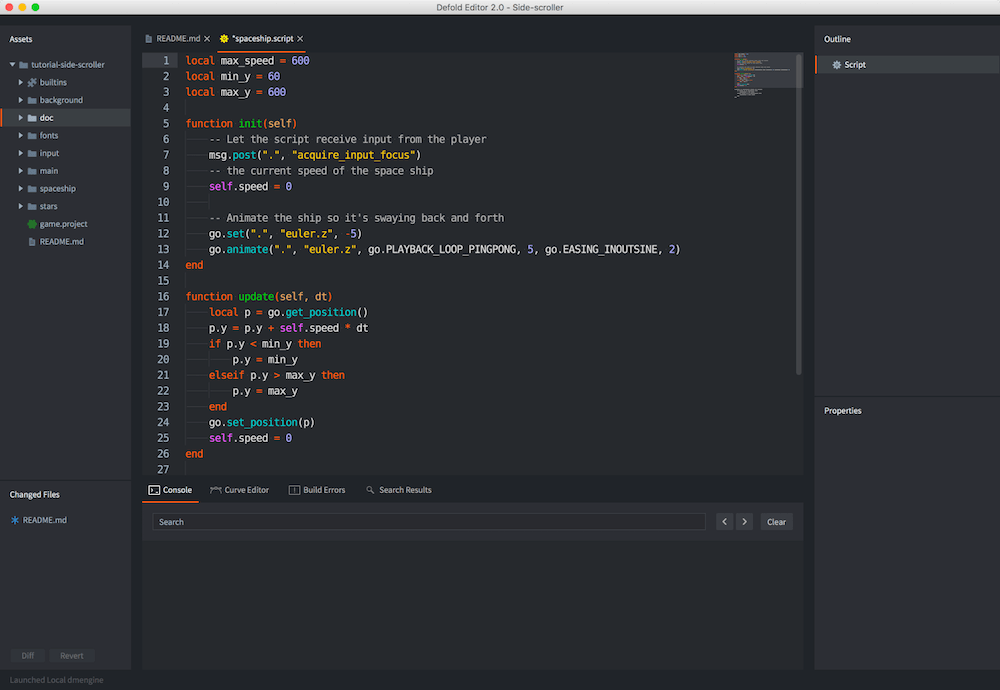
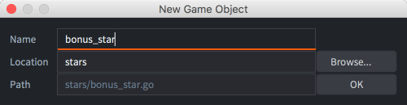
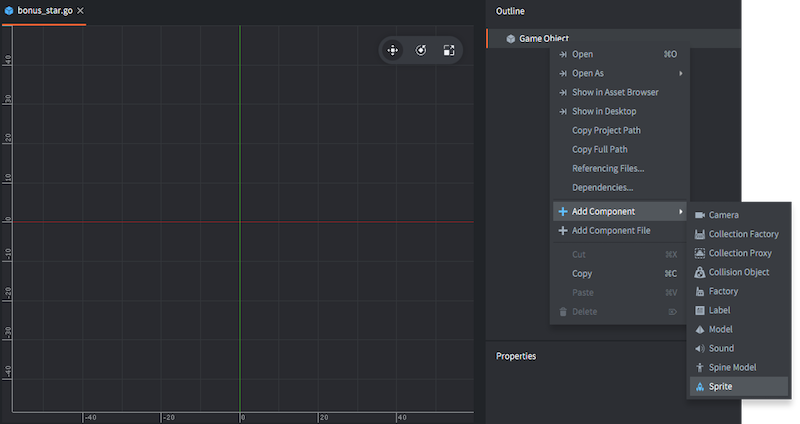
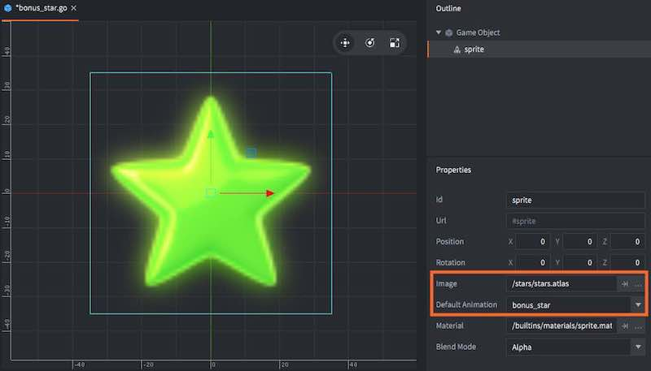
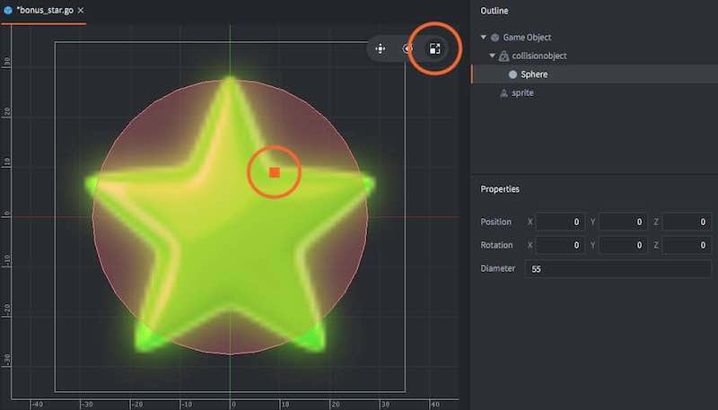
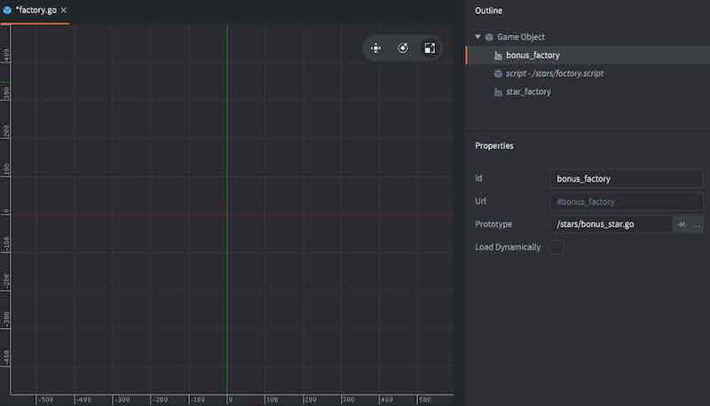
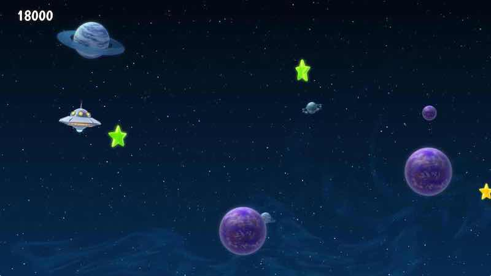

# Side scroller tutorial

Welcome to the side scroller Defold tutorial where you will get a first taste of what making games in Defold is about. You will learn how to tweak a game to make it more fun and add then a new type of pickup. The tutorial should only take about 10 minutes.

The game you will work with is extremely simple. The player controls a space ship and is supposed to collect stars that appear on the screen. The ship is controlled with the up and down arrow keys on the keyboard.

The game is already set up for you so you need only to [build and run](defold://build) the game to try it. (You can also select <kbd>Project ▸ Build</kbd> in the menu to build and run)



Try steering the space ship with the arrow keys and pick up stars for points.

## Tweaking the game

The game is currently not much fun, but you can easily improve it with some simple tweaks. You will do the update tweaks to the game live so make sure that you keep the game running somewhere on your desktop.

First, let’s adjust the speed of the space ship:

1. Open the file ["spaceship.script"](defold://open?path=/spaceship/spaceship.script) with the menu item <kbd>File ▸ Open Asset...</kbd>

   

2. Type the word "space" to search among all the available assets and select the file ["spaceship.script"](defold://open?path=/spaceship/spaceship.script). Click the button <kbd>Open</kbd> to open the file in the Lua code editor.

   

3. At the top of the file, change the line:

   ```lua
   local max_speed = 60
   ```

   to:

   ```lua
   local max_speed = 150
   ```

   This will increase the movement speed of the space ship.

4. Reload the script file into the running game with <kbd>File ▸ Hot Reload</kbd>.

Try moving the space ship with the arrow-keys on your keyboard. Notice how it moves faster now.

Currently, the player only gets 1 point for each star collected. More score is more fun so let’s fix that.

1. Open the file "star.script". Either use <kbd>File ▸ Open Asset...</kbd> or find the file in the *Assets* browser in the leftmost editor pane and double click it. The file is in the folder named "star".

2. At the top of the file, change:

   ```lua
   local score = 1
   ```

   to:

   ```lua
   local score = 1000
   ```

3. Reload the script file into the running game with <kbd>File ▸ Hot Reload</kbd>.

Try to collect some stars and notice how the score has dramatically increased.

## Adding bonus stars

The game would be more interesting if bonus stars would appear now and then. In order to make that happen, you need to create a new *game object file*, which will work as a blueprint for the new type of star.

1. Add a new game object file. Right-click the "stars" folder in the *Assets* view and select <kbd>New... ▸ Game Object</kbd>. Name the new file "bonus_star". (The editor will automaticaly append a file type suffix so the full name will be "bonus_star.go".)

   

2. The editor automatically opens the new file so you can edit it.

3. Add a *Sprite* component to the game object. Right-click the root of the *Outline* view and select <kbd>Add Component ▸ Sprite</kbd>. This allows you to attach graphics to the bonus star.

   

In the Outline view, you will see a new item called "sprite". When it is clicked, its properties are displayed in the *Properties* view below. The sprite currently has no graphics attached so you need to do that:

1. Set the *Image* property to "stars.atlas" by using the browse-button (<kbd>...</kbd>) The atlas contains the graphics for the bonus star.

2. Set *Default Animation* to "bonus_star". "bonus_star" is an animation defined in the atlas.

   

3. A green star should now appear in the editor. Hit the <kbd>F</kbd> key or select <kbd>View ▸ Frame Selection</kbd> if the view of the star is not very good.

4. Add a *Collision Object* component to the game object. Right click the root "Game Object" item in the *Outline* view and select <kbd>Add Component ▸ Collision Object</kbd>. This lets the bonus stars collide with other game objects, like the player's space ship. This is necessary so the player can gather the bonus stars as well as ordinary stars.

5. Click on the "collisionobject" item in the *Outline* view to show its properties.

6. In the *Properties* view, set the *Type* property to "Kinematic". This means that the collision object will follow the game object it belongs to.

7. Right click "collisionobject" in the *Outline* view and select <kbd>Add Shape ▸ Sphere</kbd>. Any shape(s) you add to the collision object defines its boundary as far as collisions are concerned.

8. Select the *Scale Tool* in the toolbar and use the scale handle to resize the sphere in the scene view until it reasonably covers the star. You can also edit the *Diameter* property directly in the *Properties* view.

   

9. Right click the root "Game Object" item in the *Outline* view again and select <kbd>Add Component File</kbd>, then select the script file "bonus_star.script". This script moves the bonus stars and make sure the player gets the right amount of points for catching them.

The bonus star game object file that you have now created contains the blueprint for a game object containing graphics (the sprite), collision shapes (the collision object) and logic that moves the star and reacts to collisions (the script).

## Creating the bonus star factory

Factory Components are responsible for making sure game objects of various kind appear in the game. For your new bonus stars, you need to create a factory:

1. Open the file "factory.go" with <kbd>File ▸ Open Assets...</kbd>. This game object file contains a script and a factory.

2. Add a secondary factory component to it. Right click the root "Game Object" item in the *Outline* view and select <kbd>Add Component ▸ Factory</kbd>.

3. Set the new factory component's *Id* property to "bonus_factory".

4. Set its *Prototype* property to "bonus_star.go" with the browse-button (<kbd>...</kbd>)

   

## Modify the factory script

The last step is to make sure the factory game object starts creating the bonus stars by modifying its script.

1. Open "factory.script" with <kbd>File ▸ Open Assets...</kbd>

2. Near the bottom of the file, change:

   ```lua
   -- component = "#bonus_factory"
   ```

   to:

   ```lua
   component = "#bonus_factory"
   ```

   This causes the bonus stars to appear roughly 20% of the time.

3. Restart the game by closing the window (or press <kbd>Escape</kbd> – assuming you have enabled the "Escape Quits Game" option in <kbd>File ▸ Preferences</kbd>), then select <kbd>Project ▸ Build</kbd> from the editor menu.

   The new bonus stars will start to appear!



*You Win!*

Now go ahead and create more games in Defold!

Check out [the documentation pages](https://defold.com/learn) for examples, tutorials, manuals and API docs.

If you run into trouble, help is available in [our forum](https://forum.defold.com).

Happy Defolding!

----

# Учебник по боковому скроллеру

Добро пожаловать в учебник по боковому скроллеру Defold, где вы получите первое представление о том, что такое создание игр в Defold. Вы узнаете, как настроить игру, чтобы сделать ее более увлекательной, и добавить новый тип подбора. Учебник должен занять всего около 10 минут.

Игра, с которой вы будете работать, чрезвычайно проста. Игрок управляет космическим кораблем и должен собирать звезды, которые появляются на экране. Корабль управляется клавишами со стрелками вверх и вниз на клавиатуре.

Игра уже настроена для вас, поэтому вам нужно только [собрать и запустить](defold://build) игру, чтобы попробовать ее. (Вы также можете выбрать <kbd>Проект ▸ Сборка</kbd> в меню для сборки и запуска)


Попробуйте управлять космическим кораблем с помощью клавиш со стрелками и собирать звезды для получения очков.

## Тонкая настройка игры

В настоящее время игра не очень интересна, но вы можете легко улучшить ее с помощью нескольких простых настроек. Вы будете вносить обновления в игру в реальном времени, поэтому убедитесь, что вы сохраняете игру запущенной где-то на своем рабочем столе.

Сначала давайте настроим скорость космического корабля:

1. Откройте файл ["spaceship.script"](defold://open?path=/spaceship/spaceship.script) с помощью пункта меню <kbd>Файл ▸ Открыть ресурс...</kbd>


2. Введите слово "space", чтобы выполнить поиск среди всех доступных ресурсов, и выберите файл ["spaceship.script"](defold://open?path=/spaceship/spaceship.script). Нажмите кнопку <kbd>Открыть</kbd>, чтобы открыть файл в редакторе кода Lua.


3. В верхней части файла измените строку:

```lua
local max_speed = 60
```

на:

```lua
local max_speed = 150
```

Это увеличит скорость движения космического корабля.

4. Перезагрузите файл скрипта в запущенную игру с помощью <kbd>Файл ▸ Горячая перезагрузка</kbd>.

Попробуйте переместить космический корабль с помощью клавиш со стрелками на клавиатуре. Обратите внимание, как он теперь движется быстрее.

В настоящее время игрок получает только 1 очко за каждую собранную звезду. Больше очков — веселее, так что давайте это исправим.

1. Откройте файл "star.script". Либо используйте <kbd>Файл ▸ Открыть актив...</kbd>, либо найдите файл в браузере *Активы* в самой левой панели редактора и дважды щелкните по нему. Файл находится в папке с именем "star".

2. В верхней части файла измените:

```lua
local score = 1
```

на:

```lua
local score = 1000
```

3. Перезагрузите файл скрипта в запущенную игру с помощью <kbd>Файл ▸ Горячая перезагрузка</kbd>.

Попробуйте собрать несколько звезд и обратите внимание, как резко увеличился счет.

## Добавление бонусных звезд

Игра была бы интереснее, если бы бонусные звезды появлялись время от времени. Чтобы это произошло, вам нужно создать новый *файл игрового объекта*, который будет работать как чертеж для нового типа звезды.

1. Добавьте новый файл игрового объекта. Щелкните правой кнопкой мыши папку "stars" в представлении *Assets* и выберите <kbd>Новый... ▸ Игровой объект</kbd>. Назовите новый файл "bonus_star". (Редактор автоматически добавит суффикс типа файла, поэтому полное имя будет "bonus_star.go".)


2. Редактор автоматически откроет новый файл, чтобы вы могли его редактировать.

3. Добавьте компонент *Sprite* к игровому объекту. Щелкните правой кнопкой мыши корень представления *Outline* и выберите <kbd>Добавить компонент ▸ Спрайт</kbd>. Это позволит вам прикрепить графику к бонусной звезде.


В представлении Outline вы увидите новый элемент с названием "sprite". При щелчке по нему его свойства отображаются в представлении *Properties* ниже. В настоящее время к спрайту не прикреплена графика, поэтому вам нужно сделать следующее:

1. Установите свойство *Image* на "stars.atlas" с помощью кнопки обзора (<kbd>...</kbd>). Атлас содержит графику для бонусной звезды.

2. Установите *Default Animation* на "bonus_star". "bonus_star" — это анимация, определенная в атласе.


3. Теперь в редакторе должна появиться зеленая звезда. Нажмите клавишу <kbd>F</kbd> или выберите <kbd>Вид ▸ Выбор кадра</kbd>, если вид звезды не очень хороший.

4. Добавьте компонент *Объект столкновения* к игровому объекту. Щелкните правой кнопкой мыши корневой элемент "Объект игры" в представлении *Контур* и выберите <kbd>Добавить компонент ▸ Объект столкновения</kbd>. Это позволяет бонусным звездам сталкиваться с другими игровыми объектами, например, с космическим кораблем игрока. Это необходимо, чтобы игрок мог собирать бонусные звезды, а также обычные звезды.

5. Щелкните элемент "collisionobject" в представлении *Контур*, чтобы отобразить его свойства.

6. В представлении *Свойства* установите свойство *Тип* на "Кинематический". Это означает, что объект столкновения будет следовать за игровым объектом, к которому он принадлежит.

7. Щелкните правой кнопкой мыши "collisionobject" в представлении *Outline* и выберите <kbd>Добавить форму ▸ Сфера</kbd>. Любая форма(ы), которую вы добавляете к объекту столкновения, определяет его границу в том, что касается столкновений.

8. Выберите *Scale Tool* на панели инструментов и используйте ручку масштабирования, чтобы изменить размер сферы в представлении сцены, пока она не будет достаточно закрывать звезду. Вы также можете редактировать свойство *Diameter* непосредственно в представлении *Properties*.


9. Снова щелкните правой кнопкой мыши корневой элемент "Game Object" в представлении *Outline* и выберите <kbd>Добавить файл компонента</kbd>, затем выберите файл скрипта "bonus_star.script". Этот скрипт перемещает бонусные звезды и гарантирует, что игрок получит правильное количество очков за их поимку.

Файл игрового объекта бонусной звезды, который вы только что создали, содержит чертеж игрового объекта, содержащего графику (спрайт), формы столкновений (объект столкновения) и логику, которая перемещает звезду и реагирует на столкновения (скрипт).

## Создание фабрики бонусных звезд

Компоненты фабрики отвечают за то, чтобы игровые объекты различных видов появлялись в игре. Для ваших новых бонусных звезд вам нужно создать фабрику:

1. Откройте файл "factory.go" с помощью <kbd>Файл ▸ Открыть активы...</kbd>. Этот файл игрового объекта содержит скрипт и фабрику.

2. Добавьте к нему вторичный компонент фабрики. Щелкните правой кнопкой мыши корневой элемент "Игровой объект" в представлении *Контур* и выберите <kbd>Добавить компонент ▸ Фабрика</kbd>.

3. Установите свойство *Id* нового компонента фабрики на "bonus_factory".

4. Установите его свойство *Prototype* на "bonus_star.go" с помощью кнопки обзора (<kbd>...</kbd>)


## Измените скрипт фабрики

Последний шаг — убедиться, что игровой объект фабрики начинает создавать бонусные звезды, изменив свой скрипт.

1. Откройте "factory.script" с помощью <kbd>Файл ▸ Открыть ресурсы...</kbd>

2. В нижней части файла измените:

```lua
-- component = "#bonus_factory"
```

на:

```lua
component = "#bonus_factory"
```

Это приведет к появлению бонусных звезд примерно в 20% случаев.

3. Перезапустите игру, закрыв окно (или нажмите <kbd>Escape</kbd> – при условии, что вы включили опцию «Escape Quits Game» в <kbd>File ▸ Preferences</kbd>), затем выберите <kbd>Project ▸ Build</kbd> в меню редактора.

Начнут появляться новые бонусные звезды!


*Вы выиграли!*

Теперь продолжайте и создавайте больше игр в Defold!

Ознакомьтесь с [страницами документации](https://defold.com/learn) для примеров, учебных пособий, руководств и документации API.

Если у вас возникнут проблемы, помощь доступна на [нашем форуме](https://forum.defold.com).

Счастливого Defolding!

----