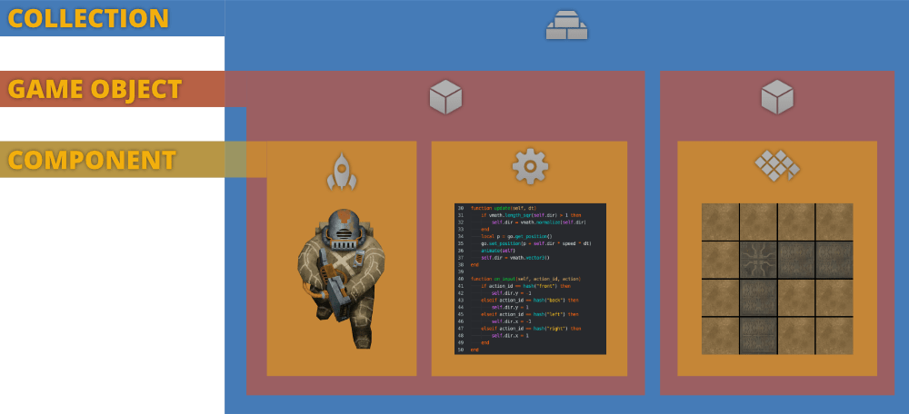
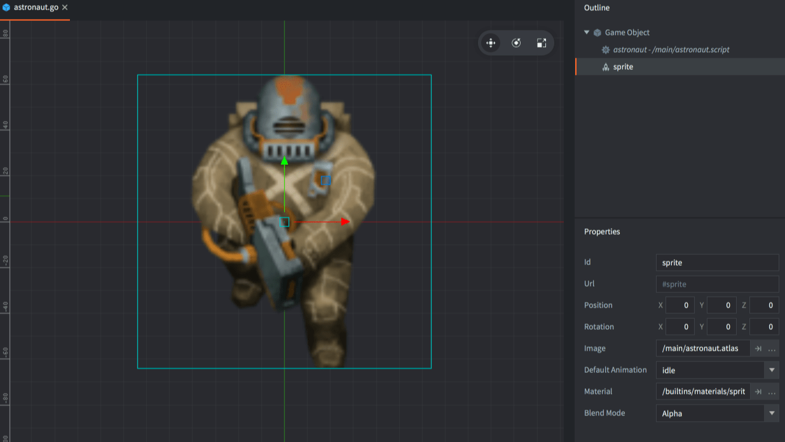

# Walking astronaut tutorial

In this beginner's tutorial you will learn how to capture player input and make a character move and animate. Along the way you will get an introduction to the core building blocks in Defold: game objects, components and collections.

This tutorial project comes preset with all assets that you need. Start by [running the game](defold://build) (<kbd>Project ▸ Build</kbd>) to get a feel for what's in here.

## The building blocks of a Defold game

Open ["/main/main.collection"](defold://open?path=/main/main.collection) (locate the file in the *Assets* pane to the left and double click it.)


What you see in the editor is a *Collection* file. When the Defold engine starts, it loads a *bootstrap collection* as specified in the "game.project" settings file. This particular collection file is this project's bootstrap collection, which is why you see the content of it when you run the game. This collection contains two *Game Objects*. And these two game objects each contain *Components*:



*COLLECTION*
: Collection files contain game objects and other collections (sub-collections). You organize your game objects by adding them to collection files. You use collections to build small things like a player character or a boss, and you use them to build big things like whole levels.

*GAME OBJECT*
: Game objects hold sprites, sounds, 3D models, tiles or scripts (programmed behavior). A game object has position, rotation and scale. You can write script code that manipulate these properties while the game is running. A typical game object is a bullet, a pickup object or a level loader.

*COMPONENT*
: Components are the things that are drawn on screen, make sounds or make interactions happen. Components do not exist on their own but are placed inside game objects. Some components have properties that can be manipulated in runtime and most components can be turned on and off (enabled and disabled). Many component types source their content from separate resource files, like atlas image files, sound files, animation files etc.

## What's in the main.collection file?

Looking at the "main.collection" file, the editor shows the visual content of the collection in the center editor view. In the right hand *Outline* pane, the collection content is presented as a tree structure. There are two game objects in the collection:

1. The astronaut game object which has *Id* "astronaut". It contains a *Sprite* component and a *Script* component. The game object has been added to the main collection from a blueprint game object file named "/main/astronaut.go".

2. The background level game object which has *Id* "level". It contains a *Tilemap* component. This game object has been embedded directly in the collection file so there is no separate file. The tilemap component, however, sources its tilemap data from a separate file named "/main/level.tilemap".

There is no difference between game objects embedded directly in a collection or ones that are based on blueprint files. If a game object exists in only one instance, there is no real advantage to using a blueprint file, but if you want to create many copies of the same object, blueprint files are extremely convenient since they allow you to change all instances at once. In the *Outline* pane the name of the file an object or component is created from is written in italics next to the object id.

## The astronaut game object

Open ["/main/astronaut.go"](defold://open?path=/main/astronaut.go) to view the blueprint file that is used to create the astronaut instance in "main.collection". As with a collection, the editor shows the game object's content in the center editor view and the *Outline* view to the right shows the structure. This game object file consists of two components:

1. A *Script* component, based on the script file "/main/astronaut.script".
2. A *Sprite* component, which is embedded in place in the game object file.



Click the sprite component to select it. The *Properties* view in the lower right corner now lists all properties that are associated with the sprite component. The sprite has its own *Id*, *Position* and *Rotation* properties. These are all relative to the game object that harbours the component. There are also properties that dictate what image or animation the sprite should display:

*Image*
: This property points to an image resource that is used as a source for the sprite's graphics. Image resources are *Atlas* or *Tilesource* files. *Atlas* files are collections of separate images that have been baked into a larger image for efficiency. Here, the property is set to the file "/main/astronaut.atlas".

*Default Animation*
: This property indicates which particular image or animation in the image resource should be used. Here, the property is set to the "idle" animation.

[Run the game again](defold://build). Notice that the astronaut sprite is looping through an idle animation. Let's now have a look at how that animation is set up.

## Atlas animations

Open the file ["/main/astronaut.atlas"](defold://open?path=/main/astronaut.atlas). The editor view in the center shows each image that has been added to the atlas. The *Outline* view shows all the images and how animations are organized.


An *Animation Group* is a list of images that are played in a specified order at a specified playback speed. There is currently only one animation group present. It's called "idle" and consists of five separate images. Select the "idle" animation in the outline and choose <kbd>View ▸ Play</kbd> from the menu to preview the animation. You may have to select <kbd>View ▸ Frame Selection</kbd> to zoom the editor camera to cover the whole atlas.

To start adding the walk animations to the astronaut, <kbd>right click</kbd> the root of the atlas outline and select <kbd>Add Animation Group</kbd>.


Click the new animation group (named "New Animation") and give it the *Id* "left". Then <kbd>right click</kbd> the animation group and select <kbd>Add Images...</kbd>


Type "left" in the top filter text field to see only images with the name "left" in them. Select all the images that appear (hold <kbd>Shift</kbd> and click) and confirm with <kbd>OK</kbd>.


The new animation has 6 images in it. Select <kbd>View ▸ Play</kbd> from the menu to preview the animation. The speed of the animation is too high so reduce the *Fps* (frames per second) property of the "left" animation from 60 to 15.

Repeat these last steps and add animations for walking "right", "front" and "back" to the atlas in the same way as you added the "left" animation.

## The astronaut script component

Remember that the astronaut game object has a *Script* component based on the file "/main/astronaut.script"? Open ["/main/astronaut.script"](defold://open?path=/main/astronaut.script) to view the Lua script file. As you can see, the script file contains a set of empty functions. These are the *lifetime functions* of the astronaut:

`init(self)`
: This function is called when the component is initialized, before anything appears on the screen. You will use this function to set a few things up.

`final(self)`
: This function is called when the component is being removed: when the game object is deleted or right before the engine shuts down your game.

`update(self, dt)`
: This function is called once each frame. It is useful for doing manipulations and calculations that need to happen it real-time. You will use this function to move the game object based on input.

`on_message(self, message_id, message, sender)`
: This function is called each time a message is sent to the script component. Message passing is a central feature of Defold but we are not doing any in this tutorial.

`on_input(self, action_id, action)`
: This function is called each time an input action is sent to the script component. Input actions are defined in the file ["/input/game.input_binding"](defold://open?path=/input/game.input_binding). This project has bindings already set up for the arrow buttons: "left", "right", "front" and "back" and you will use this function to react to input.

`on_reload(self)`
: This function is called whenever the current script component is *hot-reloaded* into a running game. This is very useful to inspect or manipulate the state of a game object at reload to test things or do debugging.

## Programming the astronaut movement

You are now ready to write a bit of Lua code to play the animations and to make the astronaut game object move. First, change the content of the `init()` function to the following:

```lua
local speed = 150                                             -- [1]

function init(self)
    msg.post(".", "acquire_input_focus")                      -- [2]
    self.dir = vmath.vector3()                                -- [3]
end
```
1. Define a local variable (constant) that holds the movement speed (in pixels/s).
2. Send a built in engine message to the current game object (".") telling it to listen to input.
3. Define a variable that is part of the current script component instance (`self`). The variable will hold the movement direction, expressed as a vector. It is initially zero.

Second, change the content of the `on_input()` function:

```lua
function on_input(self, action_id, action)
    if action_id == hash("front") then                        -- [1]
        self.dir.y = -1
    elseif action_id == hash("back") then
        self.dir.y = 1
    elseif action_id == hash("left") then                     -- [2]
        self.dir.x = -1
    elseif action_id == hash("right") then
        self.dir.x = 1
    end
end
```
1. Actions defined in the input binding file are sent in the `action_id` parameter. If the user presses the "front" or "back" button, set the Y component of the movement direction vector.
2. If the user presses the "left" or "right" button, set the X component of the movement direction vector.

Note that if the player presses "front" and "left" at the same time, two calls will be done to `on_input()` and both the X and Y components of the direction vector will be altered.

Third, change the content of the `update()` function:

```lua
function update(self, dt)
    if vmath.length_sqr(self.dir) > 1 then                   -- [1]
        self.dir = vmath.normalize(self.dir)
    end
    local p = go.get_position()                              -- [2]
    go.set_position(p + self.dir * speed * dt)               -- [3]
    self.dir = vmath.vector3()                               -- [4]
end
```
1. When the `update()` function is called, the engine has already processed all input, meaning that the direction vector is set. In the case of diagonal movement, the length of the movement vector is greater than 1. Normalizing the direction vector makes it length 1 and diagonal movement will have the same speed as horizontal and vertical movement.
2. Get the position of the current game object. The name `go` *does not* refer to the current game object. It is the name of the Lua module that contains all game object functions.
3. Set the position of the current game object to the old position plus the direction vector scaled with the speed constant and `dt`. Multiplying with `dt` makes the movement velocity independent of the update frequency.
4. Reset the direction vector since it is set each frame in `on_input`.

[Run the game again](defold://build) and verify that movement works as expected. The astronaut should move in all 8 directions.

## Adding animations to the movement

The final piece of the puzzle is to change the animation that is played depending on the movement direction. For that, you have to first add a variable that holds the current animation:

```lua
function init(self)
    msg.post(".", "acquire_input_focus")
    self.dir = vmath.vector3()
    self.current_anim = nil                                  -- [1]
end
```
1. Store the currently running animation.

Then you need to add code in `update()` that changes animation based on direction:

```lua
function update(self, dt)
    if vmath.length_sqr(self.dir) > 1 then
        self.dir = vmath.normalize(self.dir)
    end
    local p = go.get_position()
    go.set_position(p + self.dir * speed * dt)

    -- animate the astronaut

    local anim = hash("idle")                                  -- [1]

    if self.dir.x > 0 then                                     -- [2]
        anim = hash("right")
    elseif self.dir.x < 0 then
        anim = hash("left")
    elseif self.dir.y > 0 then
        anim = hash("back")
    elseif self.dir.y < 0 then
        anim = hash("front")
    end

    if anim ~= self.current_anim then                          -- [3]
        msg.post("#sprite", "play_animation", { id = anim })   -- [4]
        self.current_anim = anim                               -- [5]
    end

    -- done animating

    self.dir = vmath.vector3()
end
```
1. Local variable that starts with the default animation id. With no input, this is the animation you get.
2. Test against the movement direction and set the `anim` variable depending on the value of the X and Y component in the direction vector.
3. If `anim` is different than the current animation:
4. then play the new animation,
5. then set the current animation id to the id in `anim`.

The test against the current animation is required, otherwise the code would restart the same animation over and over again each frame. Also note that there are no separate diagonal walk animations but the code uses "left" and "right" for the diagonals.

[Run the game again](defold://build) and verify that the astronaut moves and animates correctly.

**Congratulations! You have now finished this tutorial. We hope that you found it instructive.**

Check out the [documentation pages](https://defold.com/learn) for more examples, tutorials, manuals and API docs.

If you run into trouble, help is available in [our forum](https://forum.defold.com).

Happy Defolding!


## The complete movement script

```lua
local speed = 150

function init(self)
    msg.post(".", "acquire_input_focus")
    self.dir = vmath.vector3()
    self.current_anim = nil
end

function update(self, dt)
    if vmath.length_sqr(self.dir) > 1 then
        self.dir = vmath.normalize(self.dir)
    end
    local p = go.get_position()
    go.set_position(p + self.dir * speed * dt)

    -- animate the astronaut

    local anim = hash("idle")

    if self.dir.x > 0 then
        anim = hash("right")
    elseif self.dir.x < 0 then
        anim = hash("left")
    elseif self.dir.y > 0 then
        anim = hash("back")
    elseif self.dir.y < 0 then
        anim = hash("front")
    end

    if anim ~= self.current_anim then
        msg.post("#sprite", "play_animation", { id = anim })
        self.current_anim = anim
    end

    -- done animating
    
    self.dir = vmath.vector3()
end

function on_input(self, action_id, action)
    if action_id == hash("front") then
        self.dir.y = -1
    elseif action_id == hash("back") then
        self.dir.y = 1
    elseif action_id == hash("left") then
        self.dir.x = -1
    elseif action_id == hash("right") then
        self.dir.x = 1
    end
end
```

---

# Пошаговое руководство астронавта

В этом руководстве для начинающих вы узнаете, как фиксировать действия игрока, заставлять персонажа двигаться и анимировать его. Попутно вы познакомитесь с основными компонентами Defold: игровыми объектами, компонентами и коллекциями.

Этот обучающий проект поставляется в предустановленном виде со всеми необходимыми ресурсами. Начните с [запуска игры] (defold://build) (<kbd>Project ▸ Build</kbd>), чтобы получить представление о том, что здесь находится.

## Строительные блоки игры Defold

Откройте ["/main/main.collection"](по умолчанию://открыть?путь=/main/main.collection) (найдите файл на панели "Ресурсы" слева и дважды щелкните по нему.)


В редакторе вы увидите файл *Collection*. При запуске движка Defold он загружает *bootstrap collection*, как указано в файле настроек "game.project". Этот конкретный файл коллекции является загрузочной коллекцией этого проекта, поэтому вы видите ее содержимое при запуске игры. Эта коллекция содержит два *Игровых объекта*. И каждый из этих двух игровых объектов содержит *Компоненты*:


*КОЛЛЕКЦИЯ*
: Файлы коллекций содержат игровые объекты и другие коллекции (подколлекции). Вы упорядочиваете свои игровые объекты, добавляя их в файлы коллекций. Вы используете коллекции для создания небольших объектов, таких как персонаж игрока или босс, и для создания больших объектов, таких как целые уровни.

*ИГРОВОЙ ОБЪЕКТ*
: Игровые объекты содержат спрайты, звуки, 3D-модели, плитки или сценарии (запрограммированное поведение). У игрового объекта есть положение, поворот и масштаб. Вы можете написать код сценария, который управляет этими свойствами во время игры. Типичным игровым объектом является пуля, предмет для подбора или загрузчик уровней.

*КОМПОНЕНТ*
: Компоненты - это элементы, которые отображаются на экране, издают звуки или обеспечивают взаимодействие. Компоненты не существуют сами по себе, а размещаются внутри игровых объектов. Некоторые компоненты обладают свойствами, которыми можно управлять во время выполнения, а большинство компонентов можно включать и выключать (включать и отключать деактивацию). Многие типы компонентов получают свое содержимое из отдельных файлов ресурсов, таких как файлы изображений atlas, звуковые файлы, анимационные файлы и т.д.

## Что находится в файле main.collection?

При просмотре файла "main.collection" редактор отображает визуальное содержимое коллекции в центральном редакторском окне. На правой панели "Общие сведения" содержимое коллекции представлено в виде древовидной структуры. В коллекции есть два игровых объекта:

1. Игровой объект astronaut с идентификатором "astronaut". Он содержит компонент "Sprite" и компонент "Script". Игровой объект был добавлен в основную коллекцию из файла игровых объектов blueprint с именем "/main/astronaut.go".

2. Игровой объект фонового уровня, который имеет идентификатор "level". Он содержит компонент "Tilemap". Этот игровой объект был встроен непосредственно в файл коллекции, поэтому отдельного файла нет. Компонент tilemap, однако, получает свои данные tilemap из отдельного файла с именем "/main/level.tilemap".

Нет никакой разницы между игровыми объектами, встроенными непосредственно в коллекцию, или объектами, созданными на основе файлов blueprint. Если игровой объект существует только в одном экземпляре, то в использовании файла blueprint нет реального преимущества, но если вы хотите создать много копий одного и того же объекта, файлы blueprint чрезвычайно удобны, поскольку позволяют изменять все экземпляры одновременно. На панели "Структура" название файла, из которого создается объект или компонент, выделено курсивом рядом с идентификатором объекта.

## Игровой объект "Астронавт"

Откройте ["/main/astronaut.go"](по умолчанию://open?path=/main/astronaut.go), чтобы просмотреть файл схемы, который используется для создания экземпляра astronaut в "main.collection". Как и в случае с коллекцией, редактор отображает содержимое игрового объекта в центральном редакторском окне, а в окне "Структура" справа отображается структура. Этот файл игрового объекта состоит из двух компонентов:

1. Компонент *Script*, основанный на файле сценария "/main/astronaut.script".
2. Компонент *Sprite*, который встроен в объектный файл игры.


Щелкните по компоненту sprite, чтобы выбрать его. В окне "Свойства" в правом нижнем углу теперь отображаются все свойства, связанные с компонентом sprite. У спрайта есть свои собственные свойства "Идентификатор", "Положение" и "Поворот". Все они относятся к игровому объекту, в котором находится компонент. Существуют также свойства, которые определяют, какое изображение или анимацию должен отображать спрайт:

*Изображение*
: Это свойство указывает на ресурс изображения, который используется в качестве источника для графики спрайта. Ресурсами изображения являются файлы *Atlas* или *Tilesource*. Файлы *Atlas* представляют собой наборы отдельных изображений, которые были объединены в более крупное изображение для повышения эффективности. Здесь свойству присвоено значение файла "/main/astronaut.atlas".

*Анимация по умолчанию*
: Это свойство указывает, какое конкретное изображение или анимацию в ресурсе изображений следует использовать. Здесь свойству присвоено значение анимации "idle".

[Запустите игру еще раз](defold://build). Обратите внимание, что спрайт астронавта воспроизводит анимацию в режиме ожидания. Давайте теперь посмотрим, как настраивается эта анимация.

## Анимация Атласа

Откройте файл ["/main/astronaut.atlas"](по умолчанию://открыть?путь=/main/astronaut.atlas). В редакторе в центре отображаются все изображения, которые были добавлены в атлас. В режиме просмотра "Схема" отображаются все изображения и порядок организации анимации.


Анимационная группа - это список изображений, которые воспроизводятся в указанном порядке с заданной скоростью воспроизведения. В настоящее время существует только одна анимационная группа. Она называется "idle" и состоит из пяти отдельных изображений. Выберите анимацию "в режиме ожидания" в контуре и выберите "Просмотр" ▸ "Воспроизведение" в меню, чтобы просмотреть анимацию. Возможно, вам придется выбрать "Просмотр" ▸ "Выбор кадра", чтобы увеличить масштаб камеры редактора и охватить весь атлас.

Чтобы начать добавлять анимацию ходьбы к астронавту, <kbd> щелкните правой кнопкой мыши</kbd> в корневой части схемы атласа и выберите <kbd>Добавить группу анимации</kbd>.


Щелкните новую группу анимаций (с именем "Новая анимация") и присвойте ей идентификатор "слева". Затем <kbd> щелкните правой кнопкой мыши</kbd> на группе анимация и выберите <kbd>Добавить изображения...</kbd>


Введите "left" в текстовом поле верхнего фильтра, чтобы отображались только изображения с названием "left". Выберите все появившиеся изображения (удерживайте <kbd>Shift</kbd> и нажмите) и подтвердите нажатием <kbd>OK</kbd>.


Новая анимация содержит 6 изображений. Выберите в меню "Просмотр" ▸ "Воспроизведение", чтобы просмотреть анимацию. Скорость анимации слишком высока, поэтому уменьшите значение *Fps* (кадров в секунду) для "левой" анимации с 60 до 15.

Повторите эти последние шаги и добавьте анимацию для перемещения "вправо", "вперед" и "назад" в atlas таким же образом, как вы добавили анимацию "влево".

## Компонент сценария астронавта

Помните, что игровой объект astronaut имеет компонент *Script*, основанный на файле "/main/astronaut.script"? Откройте ["/main/astronaut.script"](по умолчанию://открыть?путь=/main/astronaut.script), чтобы просмотреть файл скрипта Lua. Как вы можете видеть, файл скрипта содержит набор пустых функций. Это *функции времени жизни* астронавта:

`init(self)`
: Эта функция вызывается при инициализации компонента, до того, как что-либо появится на экране. Вы будете использовать эту функцию, чтобы настроить несколько параметров.

`окончательный(self)`
: Эта функция вызывается при удалении компонента: при удалении игрового объекта или непосредственно перед завершением работы движка вашей игры.

`обновить (self, dt)`
: Эта функция вызывается один раз в каждом кадре. Это полезно для выполнения манипуляций и вычислений, которые должны выполняться в режиме реального времени. Вы будете использовать эту функцию для перемещения игрового объекта на основе введенных данных.

`on_message(self, message_id, сообщение, отправитель)`
: Эта функция вызывается каждый раз, когда сообщение отправляется компоненту script. Передача сообщений является центральной функцией Defold, но в этом руководстве мы не будем использовать ее.

`on_input(self, action_id, action)`
: Эта функция вызывается каждый раз, когда в компонент script отправляется действие ввода. Действия по вводу определены в файле ["/input/game.input_binding"](по умолчанию://открыть?путь=/input/game.input_binding). В этом проекте уже установлены привязки для кнопок со стрелками: "влево", "вправо", "вперед" и "назад", и вы будете использовать эту функцию для реагирования на ввод.

`on_reload(self)`
: Эта функция вызывается всякий раз, когда текущий компонент скрипта "перезагружается" в запущенную игру. Это очень полезно для проверки состояния игрового объекта при перезагрузке или управления им для тестирования или отладки.

## Программирование движения астронавта

Теперь вы готовы написать немного кода на Lua для воспроизведения анимации и перемещения игрового объекта astronaut. Сначала измените содержимое функции `init()` на следующее:

``
локальная скорость lua = 150 -- [1]

функция инициализации(self)
    сообщение.post(".", "acquire_input_focus") -- [2]
    self.dir = vmath.vector3() -- [3]
end
``
1. Определите локальную переменную (константу), которая определяет скорость перемещения (в пикселях/с).
2. Отправьте встроенное в движок сообщение текущему игровому объекту (".") с просьбой прослушать вводимые данные.
3. Определите переменную, которая является частью текущего экземпляра компонента скрипта ("self"). Переменная будет содержать направление движения, выраженное в виде вектора. Изначально оно равно нулю.

Во-вторых, измените содержимое функции `on_input()`:

``
функция lua on_input(self, action_id, действие)
    если action_id == хэш("фронт"), то... [1]
        self.dir.y = -1
    иначе, если action_id == хэш("назад"), то
self.dir.y = 1
    иначе, если action_id == хэш("слева"), то -- [2]
        self.dir.x = -1
    иначе, если action_id == хэш("справа"), то
self.dir.x = 1
    конец
, конец
``
1. Действия, определенные во входном файле привязки, передаются в параметре action_id. Если пользователь нажимает кнопку "вперед" или "назад", задайте составляющую Y вектора направления движения.
2. Если пользователь нажимает кнопку "влево" или "вправо", установите X-составляющую вектора направления движения.

Обратите внимание, что если игрок нажмет "front" и "left" одновременно, будут выполнены два вызова функции on_input(), и обе составляющие вектора направления X и Y будут изменены.

В-третьих, измените содержимое функции "update()".:

``
обновление функции lua(self, dt)
    если vmath.length_sqr(self.dir) > 1, то -- [1]
        self.dir = vmath.normalize(self.dir)
    завершить
локальное p = go.get_position() -- [2]
    перейти.set_position(p + self.dir * speed * dt) -- [3]
    self.dir = vmath.vector3() -- [4]
завершить
```
1. Когда вызывается функция `update()`, движок уже обработал все входные данные, что означает, что вектор направления задан. В случае диагонального перемещения длина вектора перемещения больше 1. При нормализации вектора направления его длина равна 1, и диагональное перемещение будет иметь ту же скорость, что и горизонтальное и вертикальное перемещение.
2. Определите положение текущего игрового объекта. Название "go" *не относится к текущему игровому объекту. Это название модуля Lua, который содержит все функции игрового объекта.
3. Установите для текущего игрового объекта прежнее положение плюс вектор направления, масштабированный с учетом постоянной скорости и `dt`. Умножение на `dt` делает скорость перемещения независимой от частоты обновления.
4. Сбросьте вектор направления, поскольку он задается для каждого кадра в `on_input`.

[Запустите игру еще раз] (defold://build) и убедитесь, что движение выполняется должным образом. Астронавт должен двигаться во всех 8 направлениях.

## Добавляем анимацию к движению

Последняя часть головоломки состоит в том, чтобы изменить воспроизводимую анимацию в зависимости от направления движения. Для этого вам нужно сначала добавить переменную, которая содержит текущую анимацию:

``
функция lua init(self)
    сообщение(".", "acquire_input_focus")
    self.dir = vmath.vector3()
    self.current_anim = nil - [1]
конец
``
1. Сохраните текущую анимацию.

Затем вам нужно добавить код в `update()`, который изменяет анимацию в зависимости от направления:

``
функция lua update(self, dt)
    если vmath.length_sqr(self.dir) > 1, то
        self.dir = vmath.normalize(self.dir)
    end
local p = go.get_position()
    go.set_position(p + self.dir * speed * dt)

    -- анимировать астронавта

    локальный anim = хэш("холостой ход") -- [1]

    если self.dir.x > 0, то... [2]
        anim = хэш("правильно")
    иначе, если self.dir.x < 0, то
anim = хэш("слева")
    если self.dir.y > 0, то
anim = хэш ("назад")
    если self.dir.y < 0, то
anim = хэш ("спереди")
    конец

    если anim ~= self.current_anim, то... [3]
        сообщение ("#sprite", "play_animation", { id = anim }) _BOS_ [4]
        self.current_anim = анимация -- [5]
    конец

    -- анимация завершена

    self.dir = vmath.vector3()
end
``
1. Локальная переменная, которая начинается с идентификатора анимации по умолчанию. Без ввода данных вы получите именно такую анимацию.
2. Проверьте направление движения и установите переменную "anim" в зависимости от значения компонентов X и Y в векторе направления.
3. Если значение "anim" отличается от текущей анимации:
4. затем воспроизведите новую анимацию,
5. затем установите для идентификатора текущей анимации значение id в `anim`.

Требуется проверка на соответствие текущей анимации, в противном случае код будет перезапускать одну и ту же анимацию снова и снова в каждом кадре. Также обратите внимание, что нет отдельной анимации перемещения по диагонали, но в коде используются "влево" и "вправо" для диагоналей.

[Запустите игру еще раз] (defold://build) и убедитесь, что астронавт двигается и анимируется правильно.

** Поздравляем! Теперь вы прочитали это руководство. Мы надеемся, что оно было для вас полезным.**

Ознакомьтесь с [страницами документации](https://defold.com/learn) для получения дополнительных примеров, руководств по эксплуатации и документации по API.

Если у вас возникнут проблемы, помощь доступна на [нашем форуме](https://forum.defold.com).

Удачной дефолдинги!


## Полный сценарий перемещения

``
локальная скорость lua = 150

функция инициализируется(self)
    msg.post(".", "acquire_input_focus")
    self.dir = vmath.vector3()
    self.current_anim = нулевое
завершение

обновление функции(self, dt)
    если vmath.length_sqr(self.dir) > 1, то
self.dir = vmath.normalize(self.dir)
    завершить
локальный p = go.get_position()
    go.set_position(p + self.dir * speed * dt)

    -- анимировать астронавта

    локальный anim = хэш("холостой")

    если self.dir.x > 0, то
anim = хэш("правильный")
    если self.dir.x < 0, то
anim = хэш("влево")
    если self.dir.y > 0, то
anim = хэш("назад")
    иначе, если self.dir.y < 0, то
anim = хэш("фронт")
    конец

    если анимация ~= self.current_anim, то
сообщение ("#sprite", "play_animation", { id = анимация })
        self.current_anim = анимация
    конец

    -- анимация завершена
    
    self.dir = vmath.vector3()
конец

функция on_input(self, action_id, действие)
    если action_id == хэш ("спереди"), то
self.dir.y = -1
    иначе, если action_id == хэш("сзади"), то
self.dir.y = 1
    иначе, если action_id == хэш("слева"), то
self.dir.x = -1
    иначе, если action_id == хэш("справа"), то
self.dir.x = 1
    конец
, конец
``

---

