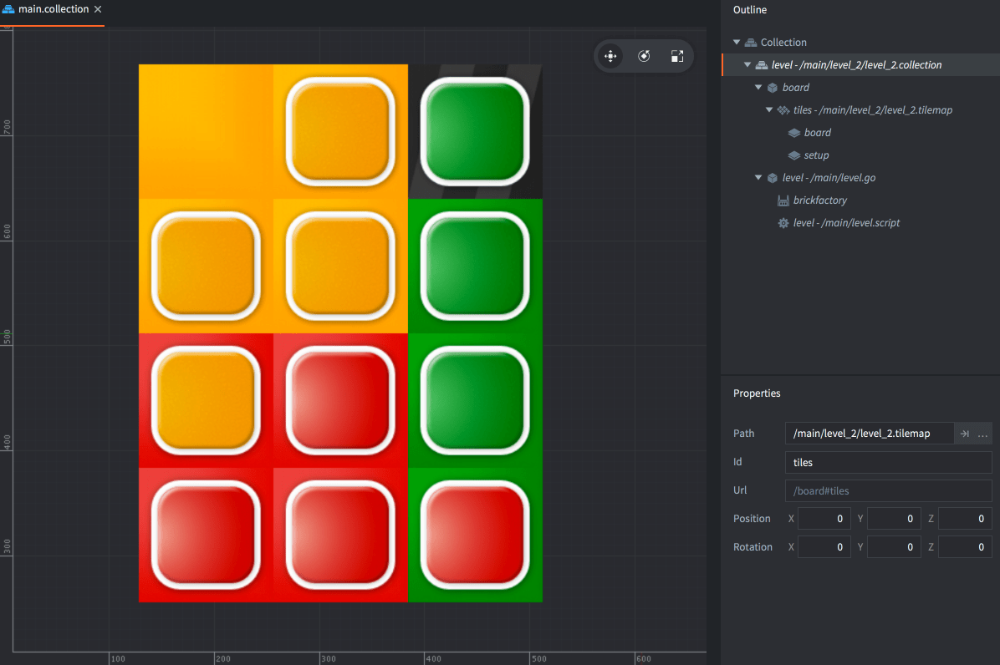
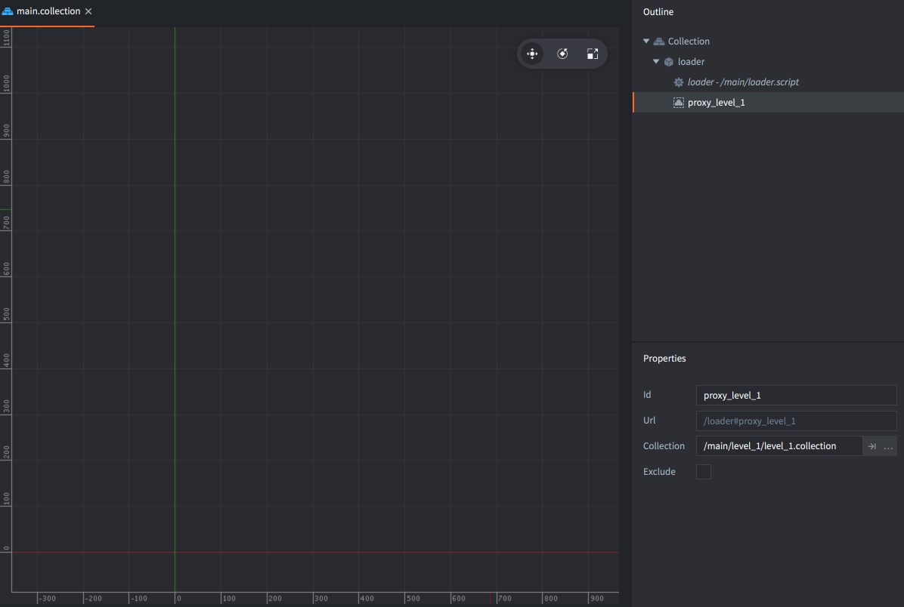
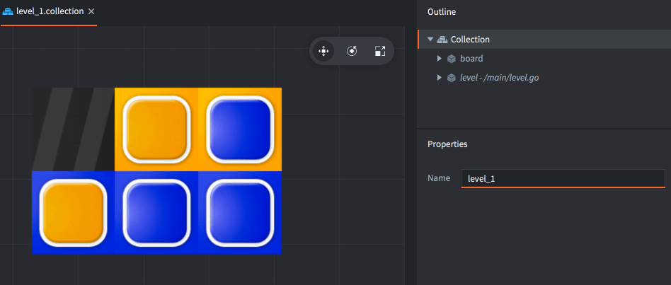
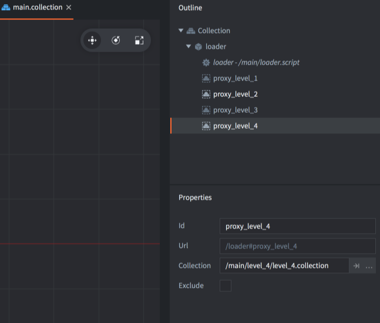
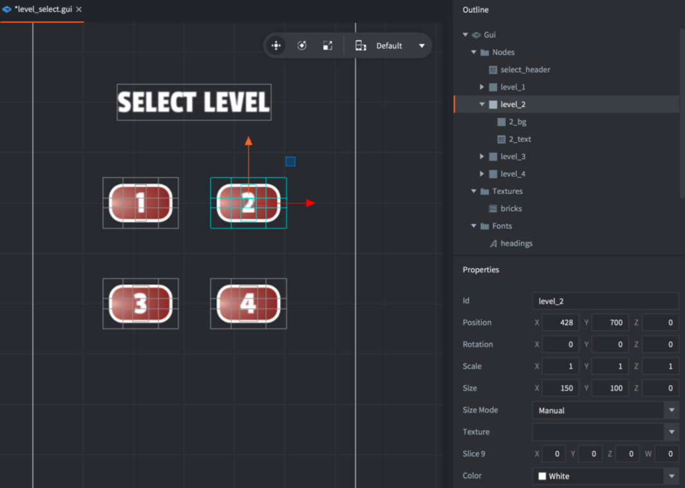
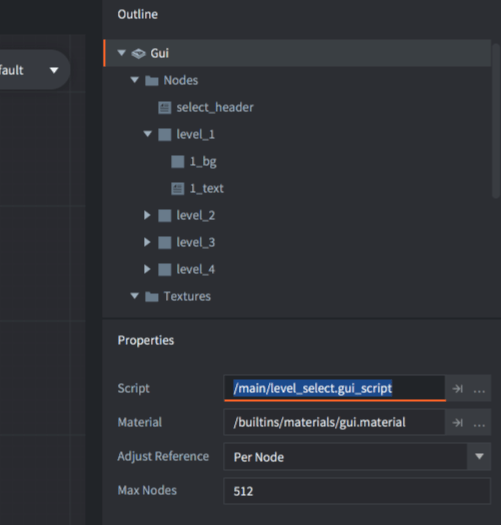
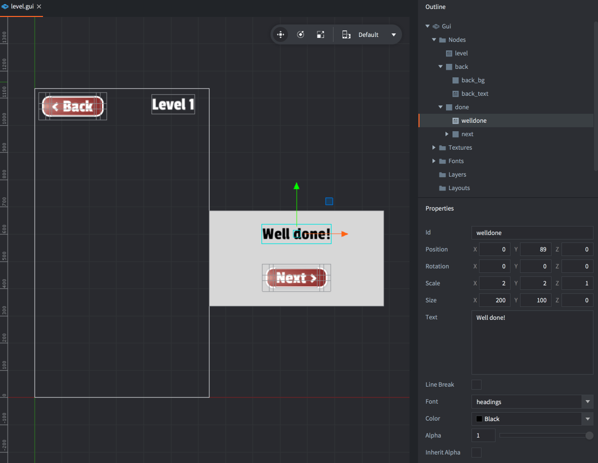
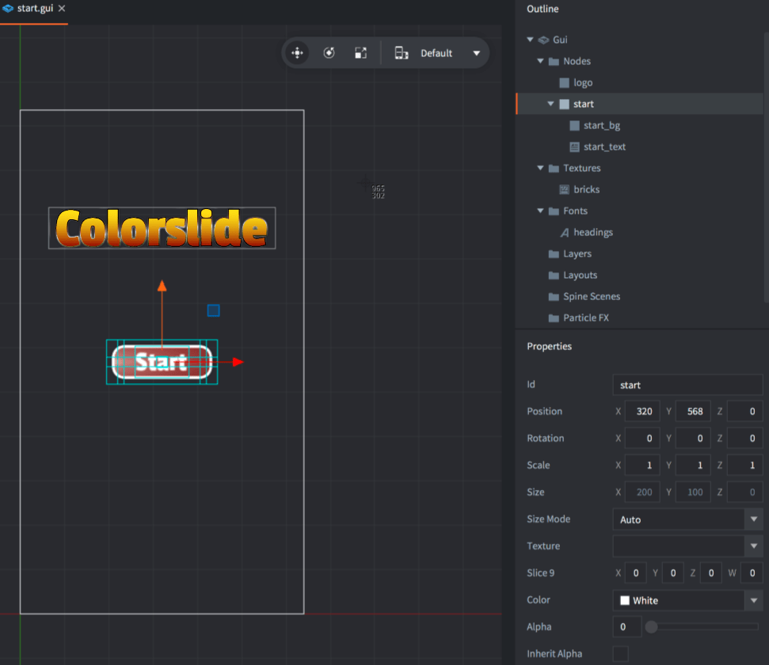
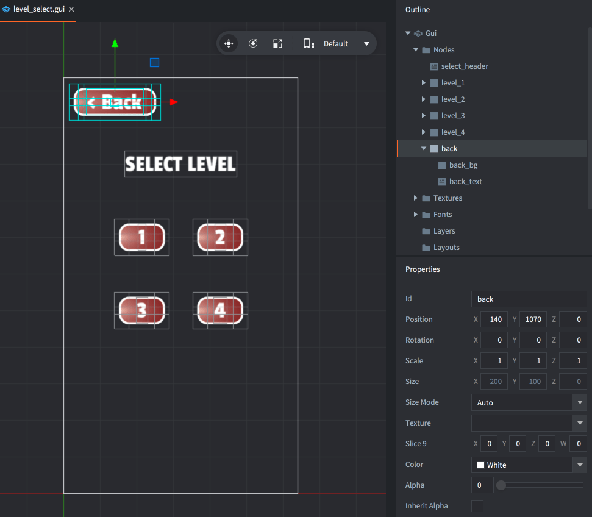

# Colorslide tutorial

Welcome to the Colorslide game tutorial. It will take you through the process of adding a simple GUI flow to an existing multi level mobile game. It is assumed that you know your way around the editor. If you don't, please check out [our manuals and beginner tutorials](https://www.defold.com/learn).

The starting point for this tutorial is this project. It contains everything you need:

- A simple but fully playable game where the player slides colored bricks on a tiled board until every brick's color matches the tile they sit on.
- 4 example levels are included. They are of various difficulty. Each level is built in its own collection.
- Assets are included so you can build any number of levels, using the built in tile editor.

After having finished the tutorial, you will have accomplished the following:

- You have added a level selection screen from where the player can start any of the 4 levels.
- You have added a level completion message allowing the player to continue to the next level.
- You have added a start screen.
- You have added buttons so the user can navigate between these screens.

## Understanding the game setup

Before beginning the tutorial, [try running the game](defold://build), then open ["main.collection"](defold://open?path=/main/main.collection) to see how the game is set up.



The whole game is contained in a subcollection called "level" inside "main.collection". Currently, "level" references the file "/main/level_2/level_2.collection". Opening the "level" collection file reveals two game objects:

1. One game object with id "board". This one contains the tilemap. Notice that there are two layers on the tilemap, one is the actual playfield (with layer id "board") and one contains the intitial setup for the bricks (with layer id "setup"). When the game starts, it looks at the setup layer and replaces the brick tiles with separate game objects that can be animated freely. It then clears the layer.

2. One game object with id "level". This one contains the game logic script ("level.script") and a factory used to spawn bricks on game start. This game object is stored in a separate file called "/main/level.go" so game objects of this blueprint file can be instantiated in each separate level collection.

Now try some of the other levels:

Open "main.collection".

Mark "level" change its reference in the *Path* property to "/main/level_3/level_3.collection".

Build and run the game again (<kbd>Project ▸ Build</kbd>). Do the same for levels 1 and 4.

## Loading collections via proxy

What is needed for this game is a way to make the level loading automatic and depending on player choice. Defold contains two mechanisms for loading collections dynamically:

1. Collection factories. This is a good choice for spawning hierarchies of objects into a running game, like enemy units, effects or interactive objects. Any spawned object will be part of the startup main collection world and live until the game shuts down, unless you explicitly delete the objects yourself.

2. Collection proxies. This is a good choice when you want to load larger chunks of a game dynamically, for instance a game level. With a proxy you create a new "world" based on the collection. Any object that is spawned from the collection content will be part of the created world and be automatically destroyed when the collection is unloaded from the proxy. The new world that is created has an overhead cost attached to it so proxies are not a good fit for spawning large quantities of small collections simultaneously.

For this game, proxies will be the best choice.

Open "main.collection" and remove the "level" collection reference. Instead, add a new game object and give it id "loader".

Add a collection proxy component to the game object, name it "proxy_level_1" and set its *Collection* property to "/main/level_1/level_1.collection".

Add a new script file called "loader.script" and add it as a script component to the "loader" game object.

NOTE: The Defold editor will automatically add `.script` to the filename you provide. Make sure to only type in `loader` as name in the New Script popup.



Open "loader.script" and change its content to the following:

```lua
function init(self)
    msg.post("#proxy_level_1", "load")                      -- [1]
end

function on_message(self, message_id, message, sender)
    if message_id == hash("proxy_loaded") then              -- [2]
        msg.post(sender, "init")
        msg.post(sender, "enable")
    end
end
```
1. Send a message to the proxy component telling it to start loading its collection.
2. When the proxy component is done loading, it sends a "proxy_loaded" message back. You can then send "init" and "enable" messages to the collection to initialize and enable the collection content. We can send these messages back to "sender" which is the proxy component.

Now try to run the game.

Unfortunately there is an instant error. The console says:

```
ERROR:GAMEOBJECT: The collection 'default' could not be created since there is already a socket with the same name.
ERROR:GAMEOBJECT: AcquireResources NewCollection RESULT_OUT_OF_RESOURCES
WARNING:RESOURCE: Unable to create resource: /main/level_1/level_1.collectionc: OUT_OF_RESOURCES
ERROR:GAMESYS: The collection /main/level_1/level_1.collectionc could not be loaded.
```

This error occurs because the proxy tries to create a new world (socket) with the name "default". But a world with that name already exists - the one created from "main.collection" at engine boot. The socket name is set in the properties of the collection root so it's very easy to fix:

Open the file "/main/level_1/level_1.collection", mark the root of the collection and set the *Name* property to "level_1". And, mark the level.go and set the *Id* property to "level_1". Save the file.



Try running the game again.

The level now shows up, but if you try to click on the board to move a tile, nothing happens. Why is that?

The problem is that the script that deals with input is now inside the proxied world. The input system works like this: 

* It sends input to all game objects in the bootstrap collection that has acquired input focus.
* If one of these objects listening to input contains a proxy, input is directed to any object in the game world behind the proxy that has acquired input focus.

So in order to get input into the proxied collection, the game object that contains the proxy component must listen to input.

Open "loader.script" and add a line to the `init()` function:

```
function init(self)
    msg.post("#proxy_level_1", "load")
    msg.post(".", "acquire_input_focus")                -- [1]
end
```
1. Since this game object holds the proxy for the collection that needs input, this game object needs to acquire input focus too.

Run the game again. Now everything should work as expected.

Because the game contains four levels you need to add proxy components for the remaining three levels. Don't forget to change the *Id* property to a unique name for each level collection so the socket names don't collide when a proxy loads.



Test that each level loads by altering the proxy component you send the "load" message:

* `msg.post("#proxy_level_1", "load")`
* `msg.post("#proxy_level_2", "load")`
* `msg.post("#proxy_level_3", "load")`
* `msg.post("#proxy_level_4", "load")`

## The level selection screen

Now you have built the setup required to load any level at any moment so it is time to construct an interface to the level loading.

Create a new GUI file and call it "level_select.gui".

Add the "headings" font to the *Font* section of the GUI (<kbd>right click</kbd> the *Fonts* item in the outline and select <kbd>Add ▸ Fonts...</kbd>).

Add the "bricks" atlas to the *Textures* section of the GUI (<kbd>right click</kbd> the *Textures* item in the outline and select <kbd>Add ▸ Textures...</kbd>).

Construct an interface with 4 buttons, one for each level. For each button:

1. Create one root Box node (<kbd>right click</kbd> *Nodes* and select <kbd>Add ▸ Box</kbd>).
2. Set the *Id* to "level_1".
3. Set the *Size Mode* to `Manual` and the *Size* to 100, 100, 0.
4. Set the *Alpha* to `0` so the node will be invisible.
5. Create a child Box node to "level_1" (<kbd>right click</kbd> "level_1" and select <kbd>Add ▸ Box</kbd>).
6. Set the *Id* of the child node to "1_bg".
7. Set the *Texture* of the node to `bricks/button`.
8. Uncheck *Inherit Alpha* on the node so it renders even if its parent is transparent.
9. Create a child Text node to "level_1" (<kbd>right click</kbd> "level_1" and select <kbd>Add ▸ Text</kbd>).
10. Set the *Id* of the child node to "1_text".
11. Set the *Text* of the node to "1".
12. Set the *Font* of the node to `headings`.
13. Uncheck *Inherit Alpha* on the node so it renders even if its parent is transparent.

If you change the size of your graphics make sure that each root node is big enough to cover the whole button graphics because the root node will be used to test input against.

Repeat the above steps for all 4 level buttons and move each root node into position. Also add a text node header:

1. Create one Text node (<kbd>right click</kbd> *Nodes* and select <kbd>Add ▸ Text</kbd>).
2. Set the *Id* to "select_header".
3. Set the *Font* to "headings".
4. Set the *Text* to "SELECT LEVEL".



Create a new GUI script file and call it "level_select.gui_script".

Open "level_select.gui_script" and change the script to the following:

```lua
function init(self)
    msg.post(".", "acquire_input_focus")
    msg.post("#", "show_level_select")                                  -- [1]
    self.active = false
end

function on_message(self, message_id, message, sender)
    if message_id == hash("show_level_select") then                     -- [2]
        msg.post("#", "enable")
        self.active = true
    elseif message_id == hash("hide_level_select") then                 -- [3]
        msg.post("#", "disable")
        self.active = false
    end
end

function on_input(self, action_id, action)
    if action_id == hash("touch") and action.pressed and self.active then
        for n = 1,4 do                                                  -- [4]
            local node = gui.get_node("level_" .. n)
            if gui.pick_node(node, action.x, action.y) then             -- [5]
                msg.post("/loader#loader", "load_level", { level = n }) -- [6]
                msg.post("#", "hide_level_select")                      -- [7]
            end
        end
    end
end
```
1. Set up the GUI.
2. Showing and hiding the GUI is triggered via messaging so it can be done from other scripts.
3. React to the pressing of touch input (as already set up in the [input bindings](defold://open?path=/input/game.input_binding)).
4. The button nodes are named "level_1" to "level_4" so they can be looped over.
5. Check if the touch action happens within the boundaries of node "level_n". This means that the click happened on the button.
6. Send a message to the loader script to load level `n`. Notice that a "load" message is not sent directly to the proxy from here since this script does not deal with the rest of the proxy loading logic, as a reaction to "proxy_loaded".
7. Hide this GUI.

Open "level_select.gui" and set the *Script* property on the root node to the new script.



To finish off this step, the loader script needs a bit of new code to react to the "load_level" message, and the proxy loading on init should be removed.

Open "loader.script" and change the `init()` and `on_message()` functions:

```lua
function init(self)
    msg.post(".", "acquire_input_focus")
end

function on_message(self, message_id, message, sender)
    if message_id == hash("load_level") then
        local proxy = "#proxy_level_" .. message.level                  -- [1]
        msg.post(proxy, "load")
    elseif message_id == hash("proxy_loaded") then
        msg.post(sender, "init")
        msg.post(sender, "enable")
    end
end
```
1. Construct which proxy to load based on message data.

Open "main.collection" and add a new game object with id "guis".

Add "level_select.gui" as a GUI component to the new "guis" game object.

Run the game and test the level selector screen. You should be able to click any of the level buttons and the corresponding level will load and be playable.

## In game GUI

You can now start and play a level but there is no way to go back. The next step is to add an in game GUI that allows you to navigate back to the level selection screen. It should also congratulate the player when the level is completed and allow moving directly to the next level:

Create a new GUI file and call it "level.gui".

Add "headings" to the *Font* section and the "bricks" atlas to the *Textures* section of the GUI.

Build one back-button at the top and one level number indicator at the top.

Build a level complete message with a "well done" message and a "next"-button. Child these to a panel (a colored box node), call it "done" and place it outside of the view so they can be slide into view when the level is completed:



Create a new GUI script file and call it "level.gui_script".

Open "level.gui_script" and change the script to the following:

```lua
function on_message(self, message_id, message, sender)
    if message_id == hash("level_completed") then                       -- [1]
        local done = gui.get_node("done")
        gui.animate(done, "position.x", 320, gui.EASING_OUTSINE, 1, 1.5)
    end
end

function on_input(self, action_id, action)                              -- [2]
    if action_id == hash("touch") and action.pressed then
        local back = gui.get_node("back")
        if gui.pick_node(back, action.x, action.y) then
            msg.post("default:/guis#level_select", "show_level_select")  -- [3]
            msg.post("default:/loader#loader", "unload_level")
        end

        local next = gui.get_node("next")
        if gui.pick_node(next, action.x, action.y) then
            msg.post("default:/loader#loader", "next_level")            -- [4]
        end
    end
end
```
1. If message "level_complete" is received, slide the "done" panel with the "next" button into view.
2. This GUI will be put on the "level" game object which already acquires input focus (through  "level.script") so this script should not do that.
3. If the player presses "back", tell the level selector to show itself and the loader to unload the level. Note that the socket name of the bootstrap collection is used in the address.
4. If the player presses "next", tell the loader to load the next level.

Open "level.gui" and set the *Script* property on the root node to the new script.

Open "loader.script" and change it to the following:

```lua
function init(self)
    msg.post(".", "acquire_input_focus")
    self.current_level = 0                                              -- [1]
end

function on_message(self, message_id, message, sender)
    if message_id == hash("load_level") then
        self.current_level = message.level
        local proxy = "#proxy_level_" .. self.current_level
        msg.post(proxy, "load")
    elseif message_id == hash("next_level") then                        -- [2]
        msg.post("#", "unload_level")
        msg.post("#", "load_level", { level = self.current_level + 1 })
    elseif message_id == hash("unload_level") then                      -- [3]
        local proxy = "#proxy_level_" .. self.current_level
        msg.post(proxy, "disable")
        msg.post(proxy, "final")
        msg.post(proxy, "unload")
    elseif message_id == hash("proxy_loaded") then
        msg.post(sender, "init")
        msg.post(sender, "enable")
    end
end
```
1. Keep track of the currently loaded level so it can be unloaded and it is possible to advance to the next one.
2. Load next level. Note that there is no check if there actually exists a next level.
3. Unload the currently loaded level.

Open "level.script" and add a message to the level gui when the game is finished at the end of `on_input()`:

```lua
                ...
                -- check if the board is solved
                if all_correct(self.bricks) then
                    msg.post("#gui", "level_completed")                 -- [1]
                    self.completed = true
                end
            end
            ...
```
1. Tell the GUI to show the level completed panel.

Finally, open "level.go" and add "level.gui" as a GUI component to the game object. Make sure to set the *Id* property of the component to "gui".

Run the game. You should be able to select a game, go back to the level selection screen (with the "back" button) and also start the next level when one is finished.

## Start screen

The final piece of the puzzle is the start screen:

Create a new GUI file and call it "start.gui".

Add "headings" to the *Font* section and the "bricks" atlas to the *Textures* section of the GUI.

Build the front screen. Add logo and a "start" button:



Create a new GUI script file and call it "start.gui_script".

Open "start.gui_script" and change the script to the following:

```lua
function init(self)
    msg.post("#", "show_start")                                         -- [1]
    self.active = false
end

function on_message(self, message_id, message, sender)
    if message_id == hash("show_start") then                            -- [2]
        msg.post("#", "enable")
        self.active = true
    elseif message_id == hash("hide_start") then
        msg.post("#", "disable")
        self.active = false
    end
end

function on_input(self, action_id, action)
    if action_id == hash("touch") and action.pressed and self.active then
        local start = gui.get_node("start")
        if gui.pick_node(start, action.x, action.y) then                -- [3]
            msg.post("#", "hide_start")
            msg.post("#level_select", "show_level_select")
        end
    end
end
```
1. Start by showing this screen.
2. Messages to show and hide this screen.
3. If the player presses the "start" button, hide this screen and tell the level selection GUI to show itself.

Open "start.gui" and set the *Script* property on the root node to the new script.

Open "main.collection" and add "start.gui" as a GUI component to the "guis" game object.

Now open "level_select.gui" and add a "back" button. You can copy and paste the one you made in "level.gui" if you want.



Open "level_select.gui_script" and add the code for returning to the start screen in `on_input()`:

```lua
function on_input(self, action_id, action)
    if action_id == hash("touch") and action.pressed and self.active then
        for n = 1,4 do
            local node = gui.get_node("level_" .. n)
            if gui.pick_node(node, action.x, action.y) then
                msg.post("/loader#loader", "load_level", { level = n })
                msg.post("#level_select", "hide_level_select")
            end
        end

        local back = gui.get_node("back")                               -- [1]
        if gui.pick_node(back, action.x, action.y) then
            msg.post("#level_select", "hide_level_select")
            msg.post("#start", "show_start")
        end
    end
end
```
1. Check if the player clicks "back". If so, hide this GUI and show the start screen.

Also edit the `init()` function so the level select GUI is hidden on startup.

```
function init(self)
    msg.post(".", "acquire_input_focus")
    msg.post("#", "hide_level_select")                                  -- [1]
    self.active = false
end
```
1. Hide the GUI on startup

And that's it. You are done! Run the game and verify that everything works as expected.

The full source code for the project at this stage can be found in the [tutorial-done branch](https://github.com/defold/tutorial-colorslide/tree/tutorial-done).

## What next?

This GUI implementation is pretty simple. Each screen deals with its own state and contains the code to hand over control to the next screen by sending messages to the other GUI component.

If your game does not feature advanced GUI flows this method is sufficient and clear enough. However, for advanced GUIs things can get hairy and in that case you might want to use some sort of screen manager that controls the flow from a central location. You can either roll your own or include an existing one as a library. Check out asset portal for community written [GUI libraries](https://defold.com/tags/stars/gui/).

If you want to continue experimenting with this tutorial project, here are some exercise suggestions:

1. You may have noticed that the "Level 1" header while playing a level is static. Add functionality so the header text shows the correct level number.
2. Implement unlocking of levels. Start the game with all but the first level locked and unlock them one by one as the game progresses.
3. Implement saving of the level unlock progression state.
4. Fix the case where the player completes the last level and there is no "next" one.
5. Use GUI templates to create the buttons.
6. Make the buttons response visually (react to press) and with sound.
7. Add sound to the game.
8. Create a solution to when there are more levels than what fits the screen.

Check out [the documentation pages](https://defold.com/learn) for more examples, tutorials, manuals and API docs.

If you run into trouble, help is available in [our forum](https://forum.defold.com).

Happy Defolding!
---

# Colorslide tutorial

Добро пожаловать в обучающее руководство по игре Colorslide. Оно проведет вас через процесс добавления простого потока графического интерфейса пользователя в существующую многоуровневую мобильную игру. Предполагается, что вы знаете, как работать с редактором. Если нет, ознакомьтесь с [нашими руководствами и руководствами для начинающих](https://www.defold.com/learn).

Отправной точкой для этого обучающего руководства является этот проект. Он содержит все, что вам нужно:

- Простая, но полностью играбельная игра, в которой игрок передвигает цветные кирпичи по плиточной доске, пока цвет каждого кирпича не совпадет с цветом плитки, на которой он находится.
- Включено 4 примера уровней. Они имеют разную сложность. Каждый уровень создан в своей собственной коллекции.
- Включены активы, поэтому вы можете построить любое количество уровней, используя встроенный редактор плиток.

После завершения обучающего руководства вы выполните следующее:

- Вы добавили экран выбора уровня, с которого игрок может начать любой из 4 уровней.

- Вы добавили сообщение о завершении уровня, позволяющее игроку перейти на следующий уровень.
- Вы добавили стартовый экран.
- Вы добавили кнопки, чтобы пользователь мог перемещаться между этими экранами.

## Понимание настройки игры

Перед началом обучения [попробуйте запустить игру](defold://build), затем откройте ["main.collection"](defold://open?path=/main/main.collection), чтобы увидеть, как настроена игра.


Вся игра содержится в подколлекции под названием "level" внутри "main.collection". В настоящее время "level" ссылается на файл "/main/level_2/level_2.collection". Открытие файла коллекции "level" показывает два игровых объекта:

1. Один игровой объект с идентификатором "board". Он содержит tilemap. Обратите внимание, что на tilemap есть два слоя, один из которых является фактическим игровым полем (с идентификатором слоя "board"), а другой содержит начальную настройку для кирпичей (с идентификатором слоя "setup"). Когда игра запускается, она смотрит на слой настройки и заменяет кирпичные плитки отдельными игровыми объектами, которые можно свободно анимировать. Затем она очищает слой.

2. Один игровой объект с идентификатором «level». Он содержит сценарий игровой логики («level.script») и фабрику, используемую для создания кирпичей при запуске игры. Этот игровой объект хранится в отдельном файле с именем «/main/level.go», поэтому игровые объекты этого файла чертежа могут быть созданы в каждой отдельной коллекции уровней.

Теперь попробуйте некоторые другие уровни:

Откройте «main.collection».

Отметьте «level» и измените его ссылку в свойстве *Path* на «/main/level_3/level_3.collection».

Соберите и запустите игру снова (<kbd>Проект ▸ Сборка</kbd>). Сделайте то же самое для уровней 1 и 4.

## Загрузка коллекций через прокси

Для этой игры необходим способ сделать загрузку уровня автоматической и зависящей от выбора игрока. Defold содержит два механизма для динамической загрузки коллекций:

1. Фабрики коллекций. Это хороший выбор для создания иерархий объектов в запущенной игре, таких как вражеские отряды, эффекты или интерактивные объекты. Любой созданный объект будет частью стартового основного мира коллекции и будет существовать до тех пор, пока игра не завершится, если вы явно не удалите объекты самостоятельно.

2. Прокси коллекций. Это хороший выбор, когда вы хотите динамически загружать большие части игры, например, игровой уровень. С помощью прокси вы создаете новый «мир» на основе коллекции. Любой объект, созданный из контента коллекции, будет частью созданного мира и будет автоматически уничтожен, когда коллекция будет выгружена из прокси. Новый созданный мир имеет накладные расходы, поэтому прокси не подходят для создания большого количества небольших коллекций одновременно.

Для этой игры лучшим выбором будут прокси.

Откройте "main.collection" и удалите ссылку на коллекцию "level". Вместо этого добавьте новый игровой объект и дайте ему идентификатор "loader".

Добавьте компонент прокси коллекции к игровому объекту, назовите его "proxy_level_1" и установите его свойство *Collection* на "/main/level_1/level_1.collection".

Добавьте новый файл скрипта с именем "loader.script" и добавьте его как компонент скрипта к игровому объекту "loader".

ПРИМЕЧАНИЕ. Редактор Defold автоматически добавит `.script` к указанному вами имени файла. Обязательно введите только `loader` в качестве имени во всплывающем окне "Новый скрипт".


Откройте "loader.script" и измените его содержимое на следующее:

```lua
function init(self)
msg.post("#proxy_level_1", "load") -- [1]
end

function on_message(self, message_id, message, sender)
if message_id == hash("proxy_loaded") then -- [2]
msg.post(sender, "init")
msg.post(sender, "enable")
end
end
```
1. Отправьте сообщение компоненту proxy, сообщая ему о необходимости начать загрузку своей коллекции.
2. Когда компонент proxy завершит загрузку, он отправит обратно сообщение "proxy_loaded". Затем вы можете отправить сообщения "init" и "enable" в коллекцию, чтобы инициализировать и включить содержимое коллекции. Мы можем отправить эти сообщения обратно "sender", который является компонентом proxy.

Теперь попробуйте запустить игру.

К сожалению, возникает мгновенная ошибка. Консоль выдает:

```
ERROR:GAMEOBJECT: Коллекция 'default' не может быть создана, так как уже существует сокет с таким же именем.
ERROR:GAMEOBJECT: AcquireResources NewCollection RESULT_OUT_OF_RESOURCES
WARNING:RESOURCE: Невозможно создать ресурс: /main/level_1/level_1.collectionc: OUT_OF_RESOURCES
ERROR:GAMESYS: Коллекция /main/level_1/level_1.collectionc не может быть загружена.
```

Эта ошибка возникает, потому что прокси пытается создать новый мир (сокет) с именем "default". Но мир с таким именем уже существует - тот, который создан из "main.collection" при загрузке движка. Имя сокета задается в свойствах корня коллекции, поэтому это очень легко исправить:

Откройте файл "/main/level_1/level_1.collection", отметьте корень коллекции и установите свойство *Name* на "level_1". И отметьте level.go и установите свойство *Id* на "level_1". Сохраните файл.


Попробуйте снова запустить игру.

Теперь уровень отображается, но если вы попытаетесь щелкнуть по доске, чтобы переместить плитку, ничего не произойдет. Почему так?

Проблема в том, что скрипт, который обрабатывает ввод, теперь находится внутри прокси-мира. Система ввода работает следующим образом:

* Она отправляет ввод всем игровым объектам в коллекции bootstrap, которая получила фокус ввода.

* Если один из этих объектов, прослушивающих ввод, содержит прокси, ввод направляется на любой объект в игровом мире за прокси, который получил фокус ввода.

Таким образом, чтобы получить ввод в прокси-коллекции, игровой объект, содержащий компонент прокси, должен прослушивать ввод.

Откройте "loader.script" и добавьте строку в функцию `init()`:
```
function init(self)
msg.post("#proxy_level_1", "load")
msg.post(".", "acquire_input_focus") -- [1]
end
```
1. Поскольку этот игровой объект содержит прокси для коллекции, которой требуется ввод, этот игровой объект также должен получить фокус ввода.

Запустите игру снова. Теперь все должно работать так, как и ожидалось.

Поскольку игра содержит четыре уровня, вам нужно добавить компоненты прокси для оставшихся трех уровней. Не забудьте изменить свойство *Id* на уникальное имя для каждой коллекции уровней, чтобы имена сокетов не конфликтовали при загрузке прокси.


Проверьте, что каждый уровень загружается, изменив компонент прокси, который вы отправляете в сообщении "load":

* `msg.post("#proxy_level_1", "load")`
* `msg.post("#proxy_level_2", "load")`
* `msg.post("#proxy_level_3", "load")`
* `msg.post("#proxy_level_4", "load")`

## Экран выбора уровня
Теперь вы создали настройку, необходимую для загрузки любого уровня в любой момент, поэтому пришло время создать интерфейс для загрузки уровня.

Создайте новый файл GUI и назовите его "level_select.gui".

Добавьте шрифт "headings" в раздел *Font* GUI (<kbd>щелкните правой кнопкой мыши</kbd> элемент *Fonts* в контуре и выберите <kbd>Добавить ▸ Шрифты...</kbd>).

Добавьте атлас "bricks" в раздел *Textures* GUI (<kbd>щелкните правой кнопкой мыши</kbd> элемент *Textures* в контуре и выберите <kbd>Добавить ▸ Текстуры...</kbd>).

Создайте интерфейс с 4 кнопками, по одной для каждого уровня. Для каждой кнопки:

1. Создайте один корневой узел Box (<kbd>щелкните правой кнопкой мыши</kbd> *Nodes* и выберите <kbd>Добавить ▸ Box</kbd>).

2. Установите *Id* на "level_1".

3. Установите *Size Mode* на `Manual`, а *Size* на 100, 100, 0.
4. Установите *Alpha* на `0`, чтобы узел был невидимым.

5. Создайте дочерний узел Box на "level_1" (<kbd>щелкните правой кнопкой мыши</kbd> "level_1" и выберите <kbd>Добавить ▸ Box</kbd>).

6. Установите *Id* дочернего узла на "1_bg".

7. Установите *Texture* узла на `bricks/button`.
8. Снимите флажок *Inherit Alpha* на узле, чтобы он отображался, даже если его родительский элемент прозрачен.
9. Создайте дочерний узел Text на "level_1" (<kbd>щелкните правой кнопкой мыши</kbd> "level_1" и выберите <kbd>Добавить ▸ Текст</kbd>).
10. Установите *Id* дочернего узла на "1_text".
11. Установите *Text* узла на "1".
12. Установите *Font* узла на `headings`.
13. Снимите флажок *Inherit Alpha* на узле, чтобы он отображался, даже если его родительский элемент прозрачен.

Если вы меняете размер графики, убедитесь, что каждый корневой узел достаточно большой, чтобы покрыть всю графику кнопки, поскольку корневой узел будет использоваться для проверки ввода.

Повторите указанные выше шаги для всех 4 кнопок уровня и переместите каждый корневой узел в нужное положение. Также добавьте заголовок текстового узла:

1. Создайте один текстовый узел (<kbd>щелкните правой кнопкой мыши</kbd> *Узлы* и выберите <kbd>Добавить ▸ Текст</kbd>).
2. Установите *Id* на "select_header".
3. Установите *Font* на "headings".
4. Установите *Text* на "SELECT LEVEL".


Создайте новый файл сценария GUI и назовите его "level_select.gui_script".

Откройте "level_select.gui_script" и измените скрипт на следующий:

```lua
function init(self)
msg.post(".", "acquire_input_focus")
msg.post("#", "show_level_select") -- [1]
self.active = false
end

function on_message(self, message_id, message, sender)
if message_id == hash("show_level_select") then -- [2]
msg.post("#", "enable")
self.active = true
elseif message_id == hash("hide_level_select") then -- [3]
msg.post("#", "disable")
self.active = false
end
end
function on_input(self, action_id, action)
if action_id == hash("touch") and action.pressed and self.active then
for n = 1,4 do -- [4]
local node = gui.get_node("level_" .. n)
if gui.pick_node(node, action.x, action.y) then -- [5]
msg.post("/loader#loader", "load_level", { level = n }) -- [6]
msg.post("#", "hide_level_select") -- [7]
end
end
end
end
```
1. Настройте GUI.
2. Отображение и скрытие GUI запускается через сообщения, поэтому это можно сделать из других скриптов.
3. Реагировать на нажатие сенсорного ввода (как уже настроено в [input bindings](defold://open?path=/input/game.input_binding)).

4. Узлы кнопок называются от "level_1" до "level_4", чтобы их можно было зациклить.

5. Проверить, произошло ли действие касания в пределах узла "level_n". Это означает, что щелчок произошел на кнопке.

6. Отправить сообщение в скрипт загрузчика для загрузки уровня `n`. Обратите внимание, что сообщение "load" не отправляется напрямую в прокси отсюда, поскольку этот скрипт не имеет дела с остальной логикой загрузки прокси, как реакция на "proxy_loaded".

7. Скрыть этот GUI.

Откройте "level_select.gui" и установите свойство *Script* в корневом узле для нового скрипта.


Чтобы завершить этот шаг, скрипту загрузчика нужно немного нового кода для реагирования на сообщение "load_level", а загрузка прокси при init должна быть удалена.

Откройте "loader.script" и измените функции `init()` и `on_message()`:

```lua
function init(self)
msg.post(".", "acquire_input_focus")
end

function on_message(self, message_id, message, sender)
if message_id == hash("load_level") then
local proxy = "#proxy_level_" .. message.level -- [1]
msg.post(proxy, "load")
elseif message_id == hash("proxy_loaded") then
msg.post(sender, "init")
msg.post(sender, "enable")
end
end
```
1. Создайте прокси для загрузки на основе данных сообщения.

Откройте "main.collection" и добавьте новый игровой объект с идентификатором "guis".

Добавьте "level_select.gui" как компонент GUI к новому игровому объекту "guis".

Запустите игру и протестируйте экран выбора уровня. Вы должны иметь возможность нажать любую из кнопок уровня, и соответствующий уровень загрузится и станет играбельным.
## В игровом GUI

Теперь вы можете начать и пройти уровень, но нет возможности вернуться назад. Следующий шаг — добавить в игру GUI, который позволит вам вернуться на экран выбора уровня. Он также должен поздравить игрока, когда уровень будет пройден, и позволить перейти непосредственно на следующий уровень:

Создайте новый файл GUI и назовите его «level.gui».

Добавьте «заголовки» в раздел *Шрифт* и атлас «кирпичи» в раздел *Текстуры* GUI.

Создайте одну кнопку «Назад» вверху и один индикатор номера уровня вверху.

Создайте сообщение о завершении уровня с сообщением «хорошо сделано» и кнопкой «далее». Добавьте их в панель (цветной узел), назовите его «done» и разместите за пределами представления, чтобы их можно было вывести на представление после завершения уровня:


Создайте новый файл сценария GUI и назовите его «level.gui_script».

Откройте "level.gui_script" и измените скрипт на следующий:

```lua
function on_message(self, message_id, message, sender)
if message_id == hash("level_completed") then -- [1]
local done = gui.get_node("done")
gui.animate(done, "position.x", 320, gui.EASING_OUTSINE, 1, 1.5)
end
end

function on_input(self, action_id, action) -- [2]
if action_id == hash("touch") and action.pressed then
local back = gui.get_node("back")
if gui.pick_node(back, action.x, action.y) then
msg.post("default:/guis#level_select", "show_level_select") -- [3]
msg.post("default:/loader#loader", "unload_level")
end

local next = gui.get_node("next")
if gui.pick_node(next, action.x, action.y) then
msg.post("default:/loader#loader", "next_level") -- [4]
end
end
end
```

1. Если получено сообщение "level_complete", выдвиньте панель "done" с кнопкой "next" в поле зрения.
2. Этот GUI будет помещен на игровой объект "level", который уже получает фокус ввода (через "level.script"), поэтому этот скрипт не должен этого делать.
3. Если игрок нажимает "back", сообщите селектору уровня, чтобы он показал себя, а загрузчику — чтобы он выгрузил уровень. Обратите внимание, что в адресе используется имя сокета коллекции bootstrap.
4. Если игрок нажимает "next", сообщите загрузчику, чтобы он загрузил следующий уровень.

Откройте "level.gui" и установите свойство *Script* в корневом узле для нового скрипта.

Откройте "loader.script" и измените его на следующее:

```lua
function init(self)
msg.post(".", "acquire_input_focus")
self.current_level = 0 -- [1]
end

function on_message(self, message_id, message, sender)
if message_id == hash("load_level") then
self.current_level = message.level
local proxy = "#proxy_level_" .. self.current_level
msg.post(proxy, "load")
elseif message_id == hash("next_level") then -- [2]
msg.post("#", "unload_level")
msg.post("#", "load_level", { level = self.current_level + 1 })
elseif message_id == hash("unload_level") then -- [3]
local proxy = "#proxy_level_" .. self.current_level
msg.post(proxy, "disable")
msg.post(proxy, "final")
msg.post(proxy, "unload")
elseif message_id == hash("proxy_loaded") then
msg.post(sender, "init")
msg.post(sender, "enable")
end
end
```
1. Отслеживайте текущий загруженный уровень, чтобы его можно было выгрузить и перейти к следующему.
2. Загрузите следующий уровень. Обратите внимание, что проверка того, существует ли на самом деле следующий уровень, не выполняется.
3. Выгрузите текущий загруженный уровень.

Откройте "level.script" и добавьте сообщение в gui уровня, когда игра будет завершена в конце `on_input()`:

```lua
...
-- проверьте, решена ли доска
if all_correct(self.bricks) then
msg.post("#gui", "level_completed") -- [1]
self.completed = true
end
end
...
```
1. Сообщите GUI, чтобы он отображал панель завершения уровня.

Наконец, откройте "level.go" и добавьте "level.gui" в качестве компонента GUI к игровому объекту. Обязательно установите свойство *Id* компонента на "gui".

Запустите игру. Вы должны иметь возможность выбрать игру, вернуться на экран выбора уровня (кнопкой «Назад»), а также начать следующий уровень после завершения предыдущего.
## Начальный экран

Последняя часть головоломки — это начальный экран:

Создайте новый файл GUI и назовите его «start.gui».

Добавьте «заголовки» в раздел *Шрифт* и атлас «кирпичи» в раздел *Текстуры* GUI.

Создайте передний экран. Добавьте логотип и кнопку «Пуск»:


Создайте новый файл сценария GUI и назовите его «start.gui_script».

Откройте "start.gui_script" и измените скрипт на следующий:

```lua
function init(self)
msg.post("#", "show_start") -- [1]
self.active = false
end

function on_message(self, message_id, message, sender)
if message_id == hash("show_start") then -- [2]
msg.post("#", "enable")
self.active = true
elseif message_id == hash("hide_start") then
msg.post("#", "disable")
self.active = false
end
end

function on_input(self, action_id, action)
if action_id == hash("touch") and action.pressed and self.active then
local start = gui.get_node("start")
if gui.pick_node(start, action.x, action.y) then -- [3]
msg.post("#", "hide_start")
msg.post("#level_select", "show_level_select")
end
end
end
```
1. Начните с показа этого экрана.
2. Сообщения для показа и скрытия этого экрана.
3. Если игрок нажимает кнопку "start", скройте этот экран и дайте команду графическому интерфейсу выбора уровня отобразить себя.
Откройте "start.gui" и установите свойство *Script* в корневом узле для нового скрипта.

Откройте "main.collection" и добавьте "start.gui" как компонент GUI к игровому объекту "guis".

Теперь откройте "level_select.gui" и добавьте кнопку "назад". Вы можете скопировать и вставить созданную вами кнопку в "level.gui", если хотите.


Откройте "level_select.gui_script" и добавьте код для возврата на начальный экран в `on_input()`:

```lua
function on_input(self, action_id, action)
if action_id == hash("touch") and action.pressed and self.active then
for n = 1,4 do
local node = gui.get_node("level_" .. n)
if gui.pick_node(node, action.x, action.y) then
msg.post("/loader#loader", "load_level", { level = n })
msg.post("#level_select", "hide_level_select")
end
end

local back = gui.get_node("back") -- [1]
if gui.pick_node(back, action.x, action.y) then
msg.post("#level_select", "hide_level_select")
msg.post("#start", "show_start")
end
end
end
```
1. Проверьте, нажал ли игрок "back". Если да, скройте этот GUI и покажите начальный экран.

Также отредактируйте функцию `init()`, чтобы GUI выбора уровня был скрыт при запуске.

```
function init(self)
msg.post(".", "acquire_input_focus")
msg.post("#", "hide_level_select") -- [1]
self.active = false
end
```
1. Скройте GUI при запуске
Вот и все. Готово! Запустите игру и убедитесь, что все работает так, как и ожидалось.

Полный исходный код проекта на этом этапе можно найти в [ветке tutorial-done](https://github.com/defold/tutorial-colorslide/tree/tutorial-done).

## Что дальше?

Эта реализация GUI довольно проста. Каждый экран имеет свое собственное состояние и содержит код для передачи управления следующему экрану путем отправки сообщений другому компоненту GUI.

Если в вашей игре нет расширенных потоков GUI, этот метод достаточен и достаточно понятен. Однако для расширенных GUI все может стать сложным, и в этом случае вам может понадобиться какой-то менеджер экранов, который управляет потоком из центрального расположения. Вы можете либо создать свой собственный, либо включить существующий в качестве библиотеки. Посетите портал ресурсов для написанных сообществом [библиотек GUI](https://defold.com/tags/stars/gui/).

Если вы хотите продолжить эксперименты с этим учебным проектом, вот несколько предложений по упражнениям:

1. Вы могли заметить, что заголовок «Уровень 1» во время игры на уровне статичен. Добавьте функциональность, чтобы текст заголовка отображал правильный номер уровня.
2. Реализуйте разблокировку уровней. Начните игру со всеми заблокированными уровнями, кроме первого, и разблокируйте их один за другим по мере прохождения игры.
3. Реализуйте сохранение состояния разблокировки уровня.
4. Исправьте случай, когда игрок завершает последний уровень, а «следующего» нет.
5. Используйте шаблоны GUI для создания кнопок.
6. Сделайте так, чтобы кнопки реагировали визуально (реагировали на нажатие) и со звуком.
7. Добавьте звук в игру.
8. Создайте решение для случая, когда уровней больше, чем помещается на экране.

Ознакомьтесь с [страницами документации](https://defold.com/learn) для получения дополнительных примеров, учебных пособий, руководств и документов API.

Если у вас возникнут проблемы, помощь доступна на [нашем форуме](https://forum.defold.com).

Счастливого Раскладывания!
---